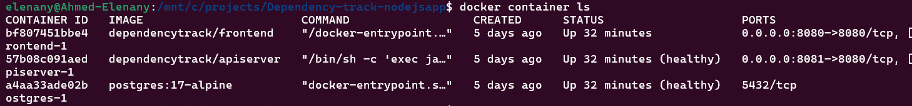

# NodeJS App

A deliberately vulnerable Node.js application used to demo [OWASP Dependency-Track](https://dependencytrack.org/)  an open-source platform for tracking and managing vulnerabilities in third-party dependencies.

## Prerequisites

- Node.js 18+
- Docker and Docker Compose
- Access to a running Dependency-Track instance

## Running Dependency-Track with Docker Compose

A `docker-compose.yml` is included to spin up the full Dependency-Track stack (API server, frontend, PostgreSQL).

```bash
docker compose up -d
```

This starts three containers:



| Service | URL |
|---|---|
| Frontend | http://localhost:8080 |
| API Server | http://localhost:8081 |

Default credentials: `admin` / `admin` (you will be prompted to change on first login).

> On first startup the API server downloads the full NVD vulnerability database which can take 2 - 3 hours. Vulnerability results will appear once the sync completes.

### Enable fuzzy matching for vulnerability detection

By default, Dependency-Track's internal analyzer matches components using CPE identifiers. Since npm packages typically don't include CPE data in their SBOMs, we need to enable fuzzy matching so the analyzer can match components by name against the NVD database.

Run this once after the stack is up:

```bash
docker exec dependencytrack-postgres-1 psql -U dtrack -d dtrack -c "
UPDATE \"CONFIGPROPERTY\" SET \"PROPERTYVALUE\" = 'true'
WHERE \"GROUPNAME\" = 'scanner' AND \"PROPERTYNAME\" = 'internal.fuzzy.enabled';

UPDATE \"CONFIGPROPERTY\" SET \"PROPERTYVALUE\" = 'false'
WHERE \"GROUPNAME\" = 'scanner' AND \"PROPERTYNAME\" = 'internal.fuzzy.exclude.purl';
"
```

Then restart the API server to apply the change:

```bash
docker restart dependencytrack-apiserver-1
```

After restarting, re-upload the SBOM and vulnerabilities will appear in the dashboard.

## What this app does

A simple Express REST API with three endpoints:

| Endpoint | Method | Description |
|---|---|---|
| `/` | GET | Returns app name and version |
| `/users` | GET | Returns a sorted list of users |
| `/login` | POST | Accepts a username and returns a signed JWT token |

## Running the app

```bash
npm install
npm start
# Server runs on http://localhost:3000
```

## Vulnerable dependencies

The app intentionally uses outdated package versions with known CVEs to demonstrate Dependency-Track's detection capabilities.

| Package | Version | CVE | Severity | Description |
|---|---|---|---|---|
| `ejs` | 2.7.4 | CVE-2022-29078 | Critical | Server-side template injection leading to RCE |
| `minimist` | 1.2.5 | CVE-2021-44906 | Critical | Prototype pollution |
| `jsonwebtoken` | 8.5.1 | CVE-2022-23539 | High | Weak key type validation — auth bypass |
| `moment` | 2.29.1 | CVE-2022-24785 | High | Path traversal via locale input |
| `node-fetch` | 2.6.0 | CVE-2022-0235 | High | Exposure of sensitive headers on redirect |
| `serialize-javascript` | 2.1.1 | CVE-2020-7660 | High | XSS via regex serialization |
| `express` | 4.18.2 | Multiple | Medium | Transitive dependency vulnerabilities |

## Generating and uploading the SBOM


### Step 1: Install cdxgen

[cdxgen](https://github.com/CycloneDX/cdxgen) is an open-source tool that scans your project and generates a CycloneDX SBOM.

```bash
npm install -g @cyclonedx/cdxgen
```

Or use it without installing via npx:

```bash
npx @cyclonedx/cdxgen --help
```

### Step 2: Generate the SBOM

Run this from the root of the project after `npm install`:

```bash
npx @cyclonedx/cdxgen -o bom.json --spec-version 1.4 .
```

This produces a `bom.json` file listing all dependencies and their metadata (name, version, PURL, hashes, licenses).

### Step 3: Upload to Dependency-Track

Get an   API key from: **Dependency-Track UI → Administration → Access Management → Teams → Automation → API Key**

Then upload:

```bash
curl -X POST "http://localhost:8081/api/v1/bom" \
  -H "X-Api-Key: API_KEY" \
  -F "autoCreate=false" \
  -F "projectName=my-app" \
  -F "projectVersion=1.0.0" \
  -F "bom=@bom.json"
```

A successful response returns a token:
```json
{"token":"xxxxxxxx-xxxx-xxxx-xxxx-xxxxxxxxxxxx"}
```

Dependency-Track will then analyze all components against its vulnerability databases (NVD, OSV, Trivy) and populate the project dashboard with findings.

---